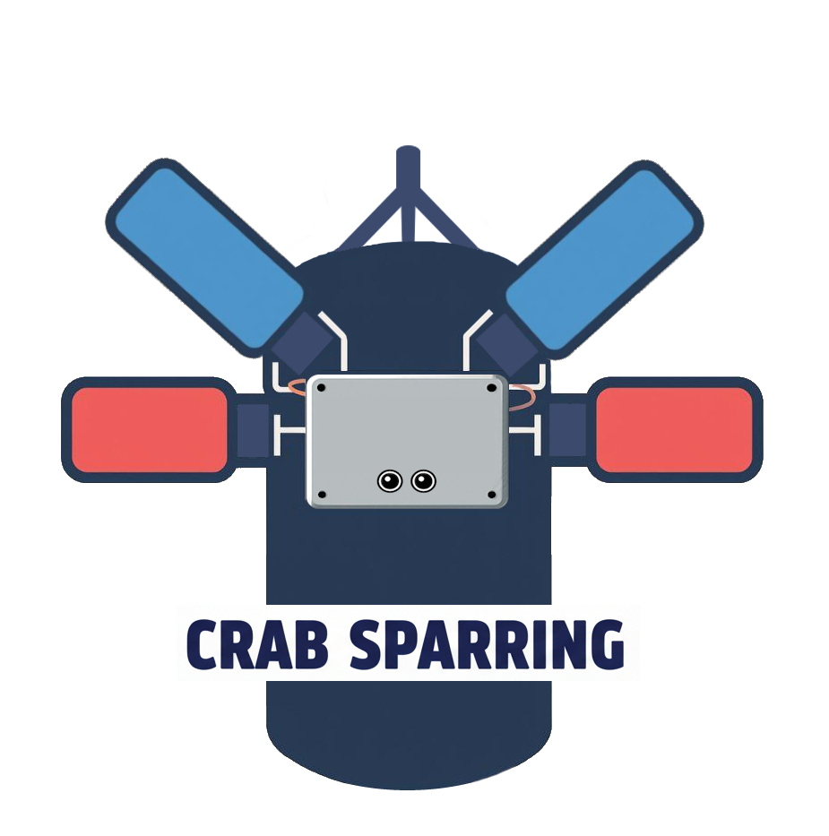

# Crab Sparring 🦀

Crab Sparring is a robot that helps you train in boxing. It can be attached to a punching bag with a simple rope and is equipped with four super-fast arms that allow it to perform various combinations of strikes, which you must try to dodge with slides and ducks, while hitting the bag. It also features a sensor that senses your distance so it can respond to the attack, just like a human opponent would.

https://www.hackster.io/maxdam75/robot-sparring-79726e

### Logo

### Schema

